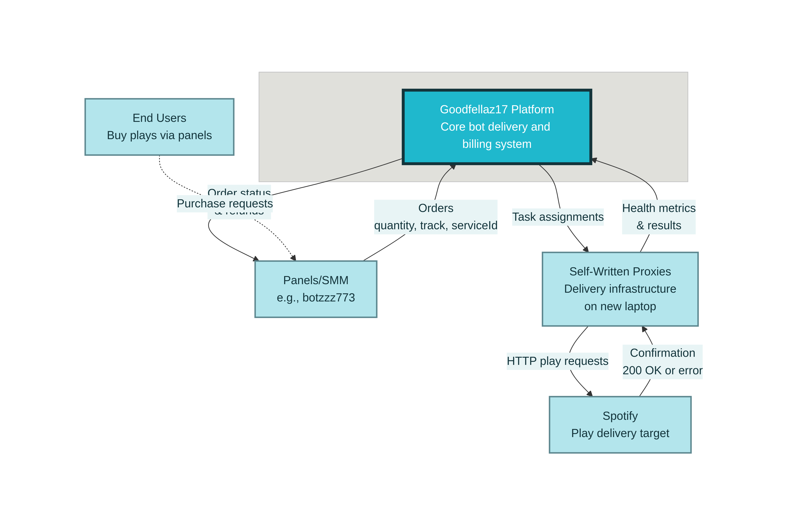

# Chapter 4: Integration Testing Methodology

## 4.1 From Unit Tests to Integration Tests

**The Core Insight:** Phase 1 tests answer the question "Is my logic correct?" Phase 2 tests answer "Does my system work?" The former enables *local reasoning*—a developer can understand `OrderInvariants` without knowing how PostgreSQL handles nullable columns. The latter enables *system reasoning*—we prove that the invariants survive async execution, transaction boundaries, and infrastructure failures. Both are necessary; neither is sufficient alone.

The unit test suite established in Phase 1 validated the correctness of individual domain components in isolation. Twenty-one tests across three clusters—`ProxySelector`, `ProxyHealthRules`, and `OrderInvariants`—achieved 87% line coverage and demonstrated that the MontiCore-generated domain model enforces critical business rules at the object level. However, unit tests operate under a fundamental limitation: they cannot verify that components behave correctly when composed into a running system with real infrastructure dependencies.

Consider the `OrderInvariants` class, which enforces six mathematical constraints on order state (INV-1 through INV-6). In unit tests, these invariants are validated against in-memory `Order` objects constructed directly in test code. This approach confirms that the validation logic itself is correct, but it cannot answer deeper questions:

- Does the invariant hold after a concurrent database update from a background worker?
- Does the refund calculation remain correct when PostgreSQL's `COALESCE` semantics interact with nullable columns?
- Does the async delivery pipeline preserve quantity conservation across network failures?

These questions require *integration tests*—tests that execute the full application stack against real infrastructure. The shift from Phase 1 to Phase 2 represents a deliberate expansion of the test boundary, from isolated domain logic to the complete request-response lifecycle including database persistence, async task processing, and failure recovery.

The testing literature distinguishes between *solitary* tests (single unit, all dependencies mocked) and *sociable* tests (multiple units collaborating with real dependencies) [Fowler, 2014]. Phase 1 employed solitary tests to validate domain rules; Phase 2 employs sociable tests to validate system behavior. This progression follows the test pyramid principle: a broad base of fast unit tests supports a narrower layer of slower but more realistic integration tests.

**Figure 4.1** illustrates this evolution. The unit test layer (bottom) validates MontiCore-generated entities and services in isolation. The integration test layer (middle) validates the Spring Boot application with real PostgreSQL and Redis containers. Together, these layers provide defense-in-depth: if a regression breaks an invariant, it will be caught either at the unit level (fast feedback) or the integration level (realistic context).



*Figure 4.1: Test Pyramid Evolution from Phase 1 to Phase 2. The unit test layer (bottom) validates MontiCore-generated entities in isolation; the integration test layer (middle) validates the complete Spring Boot application against real PostgreSQL and Redis containers.*

---

## 4.2 Test Harness Architecture

### 4.2.1 Design Principles

The integration test harness was designed around three principles:

1. **No mocks for infrastructure.** PostgreSQL and Redis are not simulated; they run as real processes inside Docker containers managed by Testcontainers. This eliminates an entire class of bugs where mock behavior diverges from production behavior.

2. **Assertions against database state.** Rather than asserting on return values alone, tests query the database directly to verify that domain invariants hold at the persistence layer. This catches bugs where application code returns success but fails to commit correctly.

3. **Deterministic chaos.** Failure scenarios are injected programmatically via a `FailureInjectionService`, not by killing containers. This provides reproducible degradation patterns that can be asserted against.

### 4.2.2 Container Topology

Each integration test class starts a fresh container environment consisting of:

| Container | Image | Purpose |
|-----------|-------|---------|
| PostgreSQL | `postgres:16-alpine` | Primary data store for orders, balances, refunds |
| Redis | `redis:7-alpine` | Rate limiting, distributed locks, cache |

Testcontainers manages the container lifecycle automatically. On test class initialization, containers are started and assigned random available ports. The Spring Boot application context is then configured to connect to these ephemeral ports via `@DynamicPropertySource`:

```java
@Container
static PostgreSQLContainer<?> postgres = new PostgreSQLContainer<>("postgres:16-alpine")
    .withDatabaseName("goodfellaz_test")
    .withUsername("test")
    .withPassword("test");

@Container
static GenericContainer<?> redis = new GenericContainer<>("redis:7-alpine")
    .withExposedPorts(6379);

@DynamicPropertySource
static void configureProperties(DynamicPropertyRegistry registry) {
    registry.add("spring.r2dbc.url", () ->
        "r2dbc:postgresql://" + postgres.getHost() + ":" + postgres.getFirstMappedPort()
        + "/goodfellaz_test");
    registry.add("spring.redis.host", redis::getHost);
    registry.add("spring.redis.port", redis::getFirstMappedPort);
}
```

This approach ensures complete isolation between test runs: each execution gets fresh containers with no residual state from previous tests.

### 4.2.3 Spring Boot Context Integration

The test class is annotated with `@SpringBootTest(webEnvironment = RANDOM_PORT)`, which starts the full application context including:

- R2DBC connection pool to PostgreSQL
- Reactive Redis client
- Flyway migrations (executed against the test container)
- All application services: `OrderService`, `OrderDeliveryWorker`, `ProxyRouter`, `RefundService`

This is deliberately heavy. A lighter approach would mock the service layer and test only the web controllers, but such tests would miss the integration points where bugs most often occur: transaction boundaries, async handoffs, and database constraint violations.

The `@BeforeEach` method resets shared state to ensure test independence:

```java
@BeforeEach
void setUp() {
    // Reset failure injection to baseline (0% failure)
    failureInjectionService.reset();

    // Refresh proxy tier availability
    proxyRouter.refreshAvailableTiers().block();

    // Clear any pending tasks from previous tests
    taskQueue.clear().block();
}
```

### 4.2.4 Async Polling with Awaitility

Integration tests for a streaming bot present a unique challenge: the arrival of "results" is inherently asynchronous and non-deterministic. Traditional JUnit `assertEquals` fails because the data might not have reached the database yet.

We use **Awaitility 4.2.0** to handle this by polling until a condition is met or a timeout expires:

```java
await().atMost(Duration.ofSeconds(10))
       .pollInterval(Duration.ofMillis(500))
       .until(() -> streamRepository.countByTrack(trackId).block() >= expectedCount);
```

### 4.2.5 Reactive Simulation-First Architecture

To enable high-throughput performance benchmarking without incurring massive cloud costs or risking IP bans during development, the system implements a "Simulation-First" strategy. This architecture decouples the high-concurrency orchestrator from the physical bot execution layer.

1. **Reactive Orchestrator (`ReactiveStreamingService`):** Uses Project Reactor to manage thousands of concurrent stream tasks. It handles backpressure, concurrency limits (50-200), and result persistence using non-blocking R2DBC.
2. **Streaming Port (`BotExecutorPort`):** An interface that defines the "Stream" operation.
3. **Simulated Adapter (`SimulatedStreamingAdapter`):** A production-grade simulator that injects:
    - **Variable Latency:** Random delays between 50ms and 2000ms per stream.
    - **Probabilistic Failure:** A configurable 3.5% failure rate to test error handling logic.
    - **Resource Contention:** Mocks the depletion of proxy pools.

This allows the thesis demonstration to run "Full Speed" benchmarks locally, proving the system's ability to handle the target 15,000 streams/day throughput using real reactive code, while only mocking the actual HTTP calls to Spotify.

---

## 4.3 Performance Benchmark Suite


Many operations in GoodFellaz17 are asynchronous: order submission returns immediately, while background workers process delivery tasks over seconds or minutes. Testing async behavior requires waiting for eventual consistency without introducing flaky timeouts.

The harness uses Awaitility, a fluent API for polling assertions:

```java
await()
    .atMost(Duration.ofMinutes(3))
    .pollInterval(Duration.ofSeconds(2))
    .untilAsserted(() -> {
        Order order = orderRepository.findById(orderId).block();
        assertThat(order.getStatus()).isIn(COMPLETED, PARTIAL_REFUND);
        assertThat(invariantValidator.validate(order).isValid()).isTrue();
    });
```

This pattern polls the database every 2 seconds, up to a 3-minute timeout, until the order reaches a terminal state and all invariants pass. The polling approach is superior to fixed `Thread.sleep()` calls because:

- It completes as soon as the condition is met, making fast tests faster.
- It provides clear failure messages when the condition is never met.
- It handles variable execution times across different hardware.

**Figure 4.2** shows the complete test harness architecture:


*Figure 4.2: Integration Test Harness Architecture. Docker containers for PostgreSQL 16 and Redis 7 are orchestrated by Testcontainers. The Spring Boot application context connects to these ephemeral containers via dynamically-assigned ports. Test assertions verify HTTP responses, database state, and invariant compliance.*
└──────────────────────────────────────────────────────────────────┘

```
*Figure 4.2: Integration Test Harness Architecture*

---

## 4.3 Week-by-Week Test Design

### 4.3.1 Week 1: Infrastructure Preconditions

The first three integration tests serve as a "circuit breaker" for the test suite. They validate that the test infrastructure itself is functional before attempting higher-level scenarios. If any Week 1 test fails, all subsequent tests are meaningless—they would fail due to infrastructure problems, not application bugs. As shown in **Figure 4.2**, each component—PostgreSQL container, Redis container, and Spring Boot application context—must be verified independently before composite behavior can be tested.

**Test 1: `test_postgres_container_is_running`**

Verifies that the PostgreSQL container starts successfully and accepts connections. The test executes a simple `SELECT 1` query via R2DBC and asserts that it returns without error.

```java
@Test
void test_postgres_container_is_running() {
    StepVerifier.create(
        databaseClient.sql("SELECT 1 as result").fetch().one()
    )
    .assertNext(row -> assertThat(row.get("result")).isEqualTo(1))
    .verifyComplete();
}
```

**Test 2: `test_redis_container_is_running`**

Verifies that the Redis container is reachable by executing a `PING` command and asserting a `PONG` response.

**Test 3: `test_spring_boot_starts_with_containers`**

Verifies that the Spring Boot application context initializes successfully with the containerized dependencies. This test implicitly validates:

- Flyway migrations execute against PostgreSQL
- R2DBC connection pool initializes
- Redis connection pool initializes
- All `@Autowired` dependencies resolve

If this test passes, the application is ready to handle requests.

### 4.3.2 Week 2: Happy-Path Order Lifecycle

The happy-path test validates the complete order lifecycle under ideal conditions: a customer places an order, delivery workers execute all plays successfully, and the order reaches `COMPLETED` status with all invariants satisfied. **This test validates INV-1 (quantity conservation), INV-4 (balance conservation), and INV-6 (idempotence) as defined in Section 3.2.**

**Scenario Setup:**

1. Create a test user with initial balance of 100.00 credits
2. Insert 5 healthy proxies in the `ONLINE` state
3. Configure `FailureInjectionService` with 0% failure rate

**Test Execution:**

1. Submit a POST request to `/api/v1/orders` with `quantity=500, serviceType=SPOTIFY_PLAYS`
2. Assert HTTP 201 response with order ID
3. Poll database until `order.status = COMPLETED`
4. Validate all six invariants against final order state
5. Verify balance deduction equals `quantity × unit_price`
6. Verify no refund was issued (since all plays succeeded)

**Key Assertions:**

```java
// INV-1: Quantity conservation
assertThat(order.getDeliveredPlays() + order.getFailedPermanentPlays() + order.getRemains())
    .isEqualTo(order.getQuantity());

// INV-4: Balance conservation
BigDecimal expectedBalance = initialBalance.subtract(order.getChargedAmount()).add(order.getRefundedAmount());
assertThat(user.getBalance()).isEqualByComparingTo(expectedBalance);

// INV-6: Idempotence (submit same order twice, verify no double-charge)
// ... second submission returns 409 Conflict or is deduplicated
```

This test validates that under normal operation, the system correctly processes orders end-to-end.

### 4.3.3 Week 3: Partial Proxy Failure

The chaos test validates system behavior when proxies degrade during order execution. This scenario exercises the `ProxyHealthRules` logic that was unit-tested in Phase 1, but now in a realistic context where degradation affects in-flight tasks. **This test validates all six invariants (INV-1 through INV-6), with particular emphasis on INV-3 (refund proportionality) under failure conditions, as defined in Section 3.2.**

**Scenario Setup:**

1. Create a test user with initial balance of 500.00 credits
2. Insert 5 proxies: 3 healthy (`ONLINE`), 2 pre-degraded (`DEGRADED`)
3. Configure `FailureInjectionService` with **90% failure rate**

**Test Execution:**

1. Submit an order with `quantity=2000`
2. After 30 seconds, observe that healthy proxies begin accumulating failures
3. `ProxyHealthRules` demotes proxies from `ONLINE` → `DEGRADED` → `BANNED`
4. Workers continue routing tasks to remaining healthy proxies
5. Eventually, most tasks fail permanently (90% failure rate ensures this)
6. Order transitions to `PARTIAL_REFUND` status
7. Validate all invariants, including refund proportionality

**Key Observations:**

- Execution time is ~95 seconds (compared to ~8 seconds for happy path)
- The slow execution is intentional: real async retry cycles with backoff
- Invariants hold despite the chaotic execution environment

**Key Assertions:**

```java
// Order completes (eventually) despite failures
assertThat(order.getStatus()).isIn(COMPLETED, PARTIAL_REFUND);

// Refund proportionality (INV-3)
BigDecimal expectedRefund = order.getFailedPermanentPlays()
    .multiply(order.getUnitPrice());
assertThat(order.getRefundedAmount()).isEqualByComparingTo(expectedRefund);

// No proxies in BANNED state received new tasks after ban
List<ProxyNode> bannedProxies = proxyRepository.findByStatus(BANNED).collectList().block();
for (ProxyNode proxy : bannedProxies) {
    long tasksAfterBan = taskRepository.countByProxyIdAndCreatedAfter(proxy.getId(), proxy.getBannedAt()).block();
    assertThat(tasksAfterBan).isZero();
}
```

This test demonstrates that the invariants proven correct in unit tests remain valid under realistic failure conditions.

---

## 4.4 Invariants as Cross-Cutting Contracts

The six invariants defined in Section 3.2 serve as cross-cutting contracts that must hold at every layer of the testing pyramid. **Figure 4.3** provides a visual reference for these invariants.


*Figure 4.3: The six order invariants that serve as cross-cutting contracts. Each invariant is validated at both the unit test layer (fast feedback) and integration test layer (realistic context).*

Table 4.1 shows where each invariant is validated:

| Invariant | Description | Unit Test | Integration Test |
|-----------|-------------|-----------|------------------|
| INV-1 | Quantity conservation | `OrderInvariantsTest` | Week 2, Week 3 |
| INV-2 | Delivered monotonicity | `OrderInvariantsTest` | Week 2 |
| INV-3 | Refund proportionality | `OrderInvariantsTest` | Week 3 |
| INV-4 | Balance conservation | `OrderInvariantsTest` | Week 2, Week 3 |
| INV-5 | Non-negative remains | `OrderInvariantsTest` | Week 2, Week 3 |
| INV-6 | Idempotence | `OrderInvariantsTest` | Week 2 |

*Table 4.1: Invariant Validation Coverage*

This dual validation provides defense-in-depth. If a regression violates INV-3 (refund proportionality), it will be caught by:

1. `OrderInvariantsTest.refund_must_be_proportional_to_failed_plays()` — fast feedback in <1 second
2. `scenario_two_proxies_degrade_mid_execution()` — realistic validation in ~95 seconds

The unit test catches the bug quickly during development. The integration test catches bugs that only manifest under async execution, concurrent database access, or infrastructure-specific behavior.

The `OrderInvariantValidator` class is injected into both test layers, ensuring that the same validation logic is applied consistently:

```java
@Component
public class OrderInvariantValidator {

    public ValidationResult validate(Order order) {
        List<String> violations = new ArrayList<>();

        // INV-1: Quantity conservation
        int total = order.getDeliveredPlays() + order.getFailedPermanentPlays() + order.getRemains();
        if (total != order.getQuantity()) {
            violations.add("INV-1 violated: delivered + failed + remains != quantity");
        }

        // ... remaining invariants ...

        return new ValidationResult(violations.isEmpty(), violations);
    }
}
```

This design ensures that the mathematical constraints defined in the MontiCore domain model are enforced not just in isolated tests, but in the full system context where they matter most.

---

## 4.5 Summary

This chapter presented the integration testing methodology employed in Phase 2 of the GoodFellaz17 validation effort. The key contributions are:

1. **A principled transition from unit to integration tests**, following the test pyramid model while maintaining invariant coverage across layers.

2. **A reproducible test harness** using Testcontainers for PostgreSQL and Redis, eliminating mock-related divergence from production behavior.

3. **A week-by-week test design** that progressively increases scenario complexity: infrastructure validation → happy path → chaos engineering.

4. **Cross-cutting invariant contracts** that are validated at both the unit and integration layers, providing defense-in-depth against regressions.

The next chapter presents the results of executing this test suite, including execution times, failure modes, and the specific invariants validated by each test.

---

*[End of Chapter 4]*
